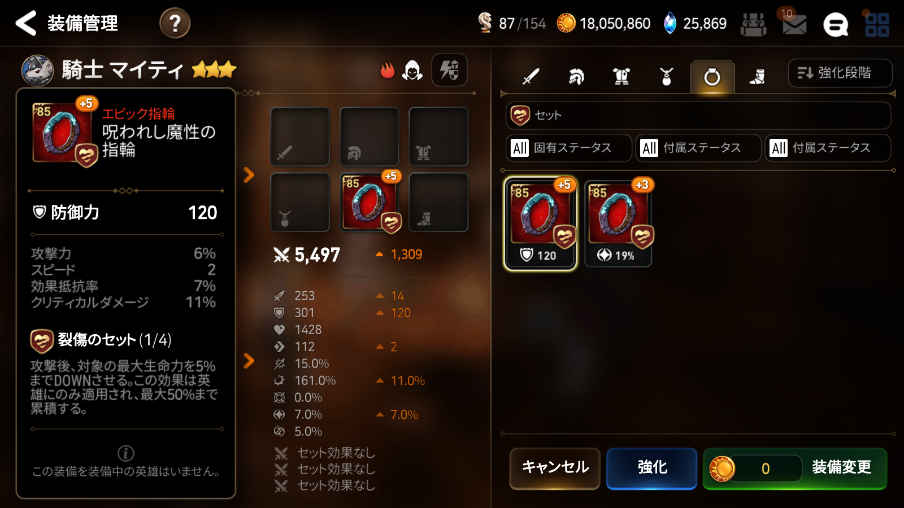

装備管理画面のスクリーンショットから装備データを抽出するためのツールです。
読み込んだデータは [Fribbels Epic 7 Gear Optimizer](https://github.com/fribbels/Fribbels-Epic-7-Optimizer) のインポート形式、もしくはcsvで保存されます。

#使い方
1. 解像度1600 x 900に設定
2. 装備管理画面で左側に装備情報が表示された状態でスクリーンショット撮影

3. [ツール画面に移動](https://cboxproject.github.io/e7gear/src/index.html)
4. 撮影したスクリーンショットをファイル選択(複数選択可)
5. ギア読み込みボタン押下

保存されたテキストファイルはOptimizerのImporterタブ、Importing gear dataで読み込むことができます。

